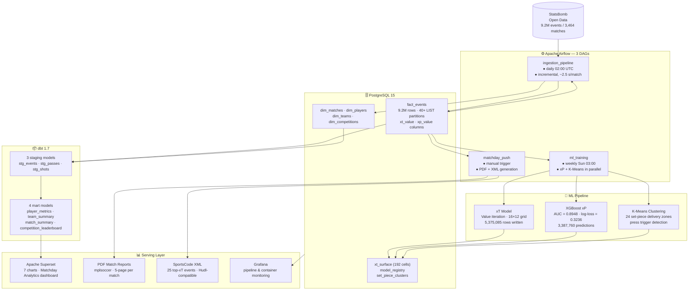

# xForge — Football Analytics Platform

[](https://github.com/bbasaranemir/xforge/actions)
[](https://www.python.org/)
[](https://airflow.apache.org/)
[](https://www.getdbt.com/)
[](https://www.postgresql.org/)
[](https://docs.docker.com/compose/)
[](https://xgboost.readthedocs.io/)
[](LICENSE)

> Production-grade football analytics platform — **9.2M+ events, 3,464 matches, XGBoost xP at AUC 0.8948**. Engineered for real-world constraints: OOM-safe server-side cursor writes, idempotent fault-tolerant restarts, and fully autonomous PDF/XML match reporting. Orchestrated end-to-end by Apache Airflow.

---

## Architecture



---

## Key Engineering Features

### Memory-Safe ML at Scale
Training an XGBoost classifier on **3.4M pass events** inside a 4 GB Codespace would OOM-kill. This pipeline solves it in two stages:

1. **Training:** stratified random sample of 300k rows via `ORDER BY RANDOM() LIMIT 300_000` — sufficient for AUC 0.8948.
2. **Prediction:** server-side `psycopg2` named cursor streams rows in **50k-row chunks**. Training data is explicitly freed with `del` + `gc.collect()` before the prediction phase begins.

```python
# server-side cursor — no full result set in RAM
cur = conn.cursor("xp_pred_cur")
cur.execute("SELECT ... FROM fact_events WHERE xp_value IS NULL")
while rows := cur.fetchmany(50_000):
    probas = model.predict_proba(build_features(rows))
    write_chunk(probas)   # commit per chunk
```

### Idempotent, Fault-Tolerant Writes
Every prediction write filters `WHERE xp_value IS NULL`. If the container is killed mid-run, restarting resumes exactly where it stopped — no duplicates, no data loss. The `postStartCommand` in `.devcontainer` auto-triggers on Codespace restart; the `run()` entrypoint exits immediately if the model file exists and zero rows remain unpredicted.

### Partitioned Data Warehouse
`fact_events` is partitioned by `competition_id` using PostgreSQL `LIST` partitioning (40+ partitions). Query planners prune irrelevant partitions automatically — full-competition scans stay fast at 9.2M rows without manual sharding.

### Autonomous Reporting Pipeline
The `matchday_push` DAG generates a complete 5-page PDF and a SportsCode/Hudl-compatible XML file for any `match_id` without human intervention. Reports are written to a volume-mounted `reports/` directory accessible from the host.

---

## ML Models

| Model | Algorithm | Target | Result |
|-------|-----------|--------|--------|
| **xT Surface** | Value iteration (15×) | Threat per pitch cell | 192 cells, max=0.298 |
| **xP Classifier** | XGBoost | Pass completion probability | AUC **0.8948**, log-loss 0.3236 |
| **Set-Piece Clustering** | K-Means | Delivery zone patterns | 24 clusters (4 types × 6) |
| **Press Trigger** | Rule-based sequence | High-press moment detection | Ball recovery + 3 defensive actions / 5 s |

**xP features:** `start_x/y`, `end_x/y`, `distance`, `angle_to_goal`, `under_pressure`, `minute_bin`

---

## Airflow DAGs

| DAG | Schedule | Tasks |
|-----|----------|-------|
| `ingestion_pipeline` | Daily 02:00 UTC | `ingest → dbt_run → dbt_test → xt_model → superset_init` |
| `ml_training` | Weekly Sun 03:00 | `tactical_models ‖ predictive_models → dbt_refresh_marts` |
| `matchday_push` | Manual trigger | `ingest_match → generate_pdf → generate_xml → send_email` |

---

## Data at Scale

| Metric | Value |
|--------|-------|
| Matches ingested | 3,464 |
| Total events | 9,200,000+ |
| DB partitions | 40+ (by competition) |
| xT records written | 5,375,085 |
| xP predictions written | 3,387,760 |
| Ingestion throughput | ~2.5 s / match |
| Write chunk size | 50,000 rows |

---

## Project Structure

```
xforge/
├── .devcontainer/
│   └── devcontainer.json          # Codespaces: docker up + xP auto-resume on restart
├── .github/
│   └── workflows/deploy.yml       # lint → test → dbt-check → deploy (EC2)
├── config/
│   ├── grafana/                   # Provisioned dashboards & Prometheus datasource
│   └── superset_config.py         # Superset secret key & DB URI
├── dags/
│   ├── ingestion_dag.py           # Daily ETL — ingest → dbt → xT → superset
│   ├── ml_dag.py                  # Weekly — xP + K-Means parallel → dbt marts
│   └── matchday_dag.py            # On-demand — ingest → PDF → XML → email
├── dbt_project/
│   └── models/
│       ├── staging/               # stg_events, stg_passes, stg_shots (4 models)
│       └── marts/                 # player_metrics, team_summary,
│                                  # match_summary, competition_leaderboard
├── scripts/
│   ├── init/                      # 01_schema.sql — tables, partitions, indexes
│   ├── massive_ingestion.py       # Incremental StatsBomb loader (upsert, 50k chunks)
│   ├── xt_model.py                # Value-iteration xT surface builder
│   ├── predictive_models.py       # XGBoost xP — sample train + chunked prediction
│   ├── tactical_models.py         # K-Means set-piece clustering + press detection
│   ├── report_generator.py        # 5-page PDF via mplsoccer + matplotlib
│   ├── xml_generator.py           # SportsCode/Hudl XML — top-25 xT events
│   └── superset_init.py           # Bootstraps saved queries on first run
├── tests/                         # pytest suite — unit + schema validation
├── docker-compose.yml             # 8 services: Airflow (3), Postgres, Superset,
│                                  #   Grafana, pgAdmin, Redis
├── Dockerfile.airflow             # Custom image: Python deps + dbt + mplsoccer
├── Makefile                       # Developer shortcuts (see below)
├── requirements.txt
└── .env.example                   # Template — copy to .env before first run
```

---

## Getting Started

### Prerequisites
- Docker ≥ 24 and Docker Compose v2
- 4 GB RAM minimum (8 GB recommended)
- Git

### 1. Clone and configure

```bash
git clone https://github.com/bbasaranemir/xforge.git
cd xforge
cp .env.example .env
```

Generate a Fernet key for Airflow and paste it into `.env`:

```bash
python3 -c "from cryptography.fernet import Fernet; print(Fernet.generate_key().decode())"
```

### 2. Launch all services

```bash
make up       # build images + start 8 containers
make status   # verify all services are healthy
```

### 3. Run the full pipeline

```bash
make ingest   # unpause + trigger ingestion_pipeline DAG
make logs     # tail scheduler logs
```

### 4. Generate a match report

```bash
make report MATCH_ID=3942349
# → reports/match_3942349.pdf  (5 pages)
# → reports/match_3942349_sportscode.xml  (25 events)
```

### 5. Access services

| Service | URL | Default credentials |
|---------|-----|---------------------|
| Airflow | http://localhost:8080 | admin / (see `.env`) |
| Superset | http://localhost:8088 | admin / admin123 |
| Grafana | http://localhost:3000 | admin / admin |
| pgAdmin | http://localhost:5050 | admin@admin.com / admin |

### GitHub Codespaces

Click **Code → Codespaces → New**. All services start automatically via `.devcontainer`; forwarded ports are pre-configured.

---

## CI/CD

Every push to `main` runs:

```
lint (black · isort · flake8)
  └─► unit tests (pytest + coverage → Codecov)
        └─► dbt compile check
              └─► deploy to EC2 (requires secrets)
```

| Secret | Purpose |
|--------|---------|
| `EC2_HOST` | EC2 public IP or DNS |
| `EC2_USER` | SSH username |
| `EC2_SSH_KEY` | Private key (PEM contents) |

The deploy job is non-blocking (`continue-on-error: true`) — CI stays green in environments without EC2 configured.

---

## Database Schema

```
dim_competitions ─┐
dim_seasons ──────┤
dim_matches ──────┤
dim_players ──────┼──► fact_events  (PARTITION BY LIST competition_id, 40+ parts)
dim_teams ────────┘         │
                            ├──► xt_surface          (192 cells, 16×12 grid)
                            ├──► model_registry       (AUC, log-loss, artifact path)
                            ├──► set_piece_clusters   (24 centroids)
                            ├──► press_events         (trigger sequences)
                            │
                            └──► analytics_marts.*
                                  ├── mart_player_metrics
                                  ├── mart_team_summary
                                  ├── mart_match_summary
                                  └── mart_competition_leaderboard
```

---

## Data Source

[StatsBomb Open Data](https://github.com/statsbomb/open-data) — used under the StatsBomb Open Data Licence. This project is not affiliated with or endorsed by StatsBomb.

---

## License

MIT
