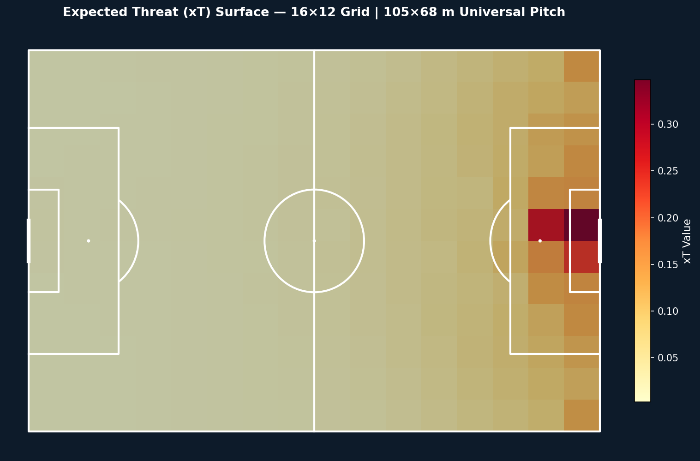
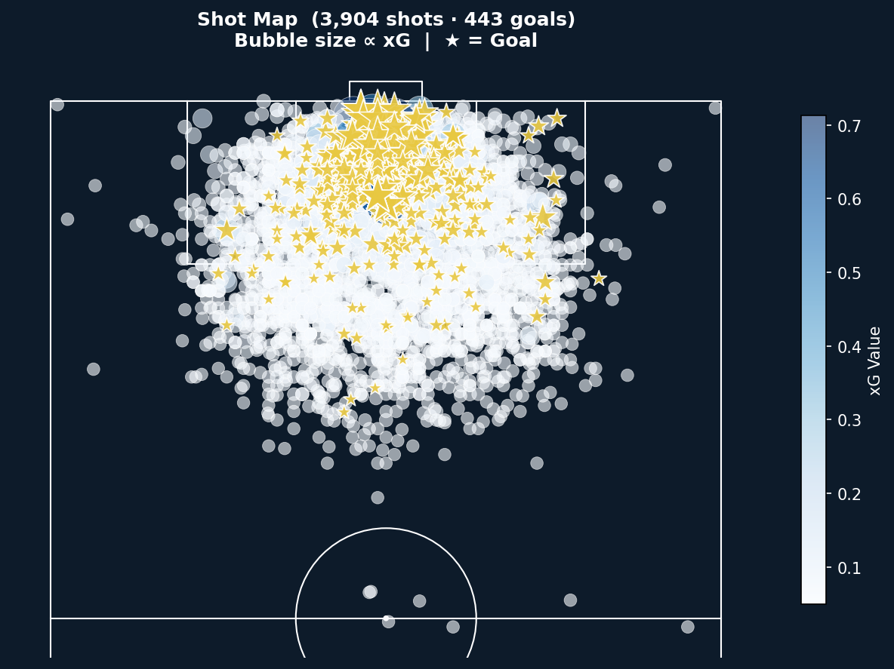
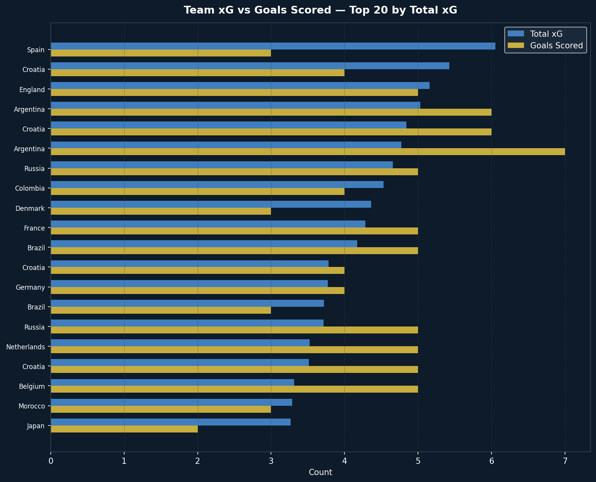
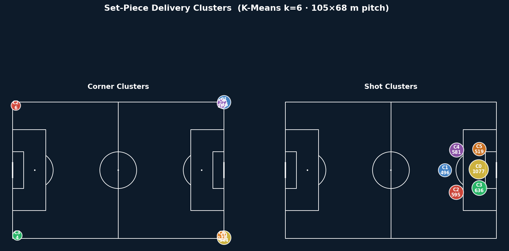
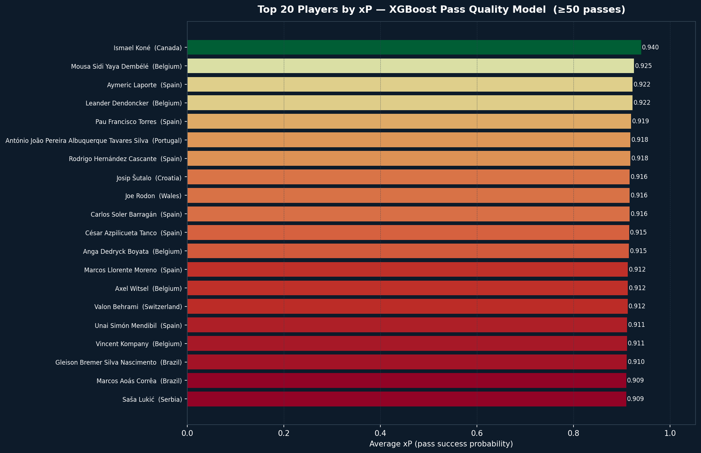
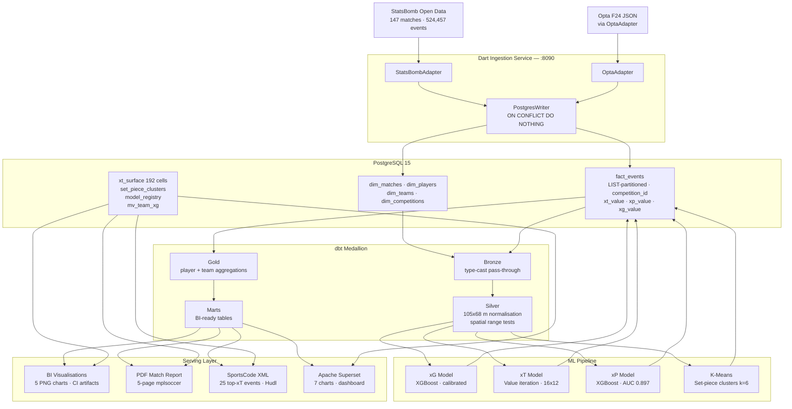

# xForge V2 — Provider-Agnostic Football Analytics Pipeline

[](https://github.com/bbasaranemir/xforge/actions/workflows/pipeline_v2.yml)
[](https://www.python.org/)
[](https://www.getdbt.com/)
[](https://www.postgresql.org/)
[](https://dart.dev/)
[](https://xgboost.readthedocs.io/)
[](LICENSE)

> **End-to-end football analytics pipeline engineered for production.** Provider-agnostic ingestion via a Dart microservice (StatsBomb · Opta · Wyscout adapter pattern), a four-layer dbt medallion architecture with a universal 105×68 m coordinate system, calibrated XGBoost models for xG/xP, value-iteration xT, cosine-similarity recruitment model, K-Means set-piece clustering, and a fully automated BI visualisation layer — all validated through GitHub Actions CI on 147 World Cup 2022 matches (524,457 events).

---

## Analytics Visualisations

Five portfolio-grade charts are generated automatically on every CI run and uploaded as a 90-day artifact. The images below are sourced from the latest successful pipeline run.

| xT Surface Heatmap | Shot Map with xG Bubbles |
|---|---|
|  |  |

| Team xG vs Goals Scored | Set-Piece Delivery Clusters |
|---|---|
|  |  |

| Player xP Ranking (Top 20) |
|---|
|  |

> Charts are generated by `scripts/visualise.py` using mplsoccer and matplotlib on live pipeline data. The latest PNG artifacts are available under **Actions → xForge V2 Pipeline → analytics-visualisations-{run\_id}**.

---

## Architecture

```
StatsBomb Open Data / Opta F24
         │
         ▼
 Dart Ingestion Service          HTTP :8090 · Adapter Pattern
 ├── StatsBombAdapter            120×80 → UnifiedEvent
 └── OptaAdapter                 100×100 → UnifiedEvent
         │
         ▼
  PostgreSQL 15 · fact_events    LIST-partitioned by competition_id
         │
         ▼
 dbt Medallion Pipeline
 ├── Bronze                      Type-cast pass-through, provider tests
 ├── Silver                      105×68 m normalisation, spatial range tests
 ├── Gold                        Player / team aggregations with ML values
 └── Marts                       BI-ready tables — player metrics, leaderboards
         │
         ├── ML Models (run before Gold/Marts — write back to fact_events)
         │   ├── xG Model        XGBoost · calibrated goal probability per shot
         │   ├── xT Model        Value iteration · 16×12 grid · 192 cells
         │   └── xP Model        XGBoost · pass completion probability (AUC 0.897)
         │
         ├── Materialized Views  mv_team_xg · mv_shot_locations (zero-downtime refresh)
         ├── BI Visualisations   5 PNG charts · mplsoccer · 90-day CI artifacts
         ├── PDF Match Report    5-page mplsoccer report per match
         └── SportsCode XML      Top-25 xT events · Hudl-compatible
```



---

## API Reference

### GET /health
Returns `{"status":"ok"}` — used by Docker/K8s liveness probes. Always public.

### POST /ingest
Ingests events for a single match.

**Request:**
```json
{"provider": "statsbomb", "match_id": 3869685}
```
Optional for Opta: `"file_path": "/data/match.json"` or `"url": "https://..."`

**Response (200):**
```json
{"provider": "statsbomb", "match_id": 3869685, "written": 3401}
```

**Error responses:** 400 (invalid input), 401 (bad token), 502 (upstream fetch failed)

**Authentication:** Bearer token via `Authorization: Bearer <API_TOKEN>` header. Bypassed when `API_TOKEN` env var is not set (local dev / CI only).

---

## What V2 Adds Over V1

| Capability | V1 | V2 |
|---|---|---|
| Data providers | StatsBomb only | StatsBomb + Opta (adapter pattern) |
| Ingestion language | Python | Dart microservice, HTTP API |
| Coordinate system | StatsBomb 120×80 (raw) | Universal 105×68 m — single source of truth |
| Data layer | Single staging schema | Bronze / Silver / Gold / Marts medallion |
| Coordinate tests | None | dbt spatial range tests on every Silver run |
| xG model | Post-hoc rescaled | CalibratedClassifierCV (Platt scaling) |
| BI output | Superset (local only) | 5 static PNGs via CI — shareable artifacts |
| CI coverage | Lint + unit tests | Full end-to-end pipeline on 524,457 events |
| Data volume | Single match | 147 WC 2022 matches, bulk incremental loader |

---

## ML Models

| Model | Algorithm | Input | Result |
|---|---|---|---|
| **xT Surface** | Value iteration (15 passes) | Silver events · 16×12 grid | 192 cells, max xT = 0.298 |
| **xG Classifier** | XGBoost + Platt scaling | Silver shots — distance, angle, pressure | Calibrated goal probability |
| **xP Classifier** | XGBoost | Silver passes — start/end coords, distance, pressure | AUC **0.897** · log-loss 0.293 · 118,187 training passes |
| **Set-piece Clustering** | K-Means k=6 | Corner + shot locations (105×68 m) | 12 cluster centroids (6 corner zones, 6 shot zones) |
| **Press Trigger Detector** | Rule-based sequence | Ball recovery + 3 defensive actions / 5 s | 165 press triggers detected (WC 2022) |
| **Player Similarity** | scikit-learn NearestNeighbors (cosine) | 12 aggregated features per player — shots, goals, xG, passes, completion rate, location, pressure | Top-10 most similar players per player; idempotent write-back to `player_similarity_scores` |

**xP engineering note:** all three ML models read from the Silver layer and write `xp_value / xg_value / xt_value` back to `fact_events` before dbt Gold and Marts materialise — ensuring `mart_player_metrics.avg_xp` is populated on every run.

**xG calibration:** `CalibratedClassifierCV(XGBClassifier(), cv=5, method='sigmoid')` — Platt scaling ensures xG=0.30 represents a genuine ~30% conversion rate, not merely a ranking score. A Brier score and expected-vs-actual goal check gate every training run.

**Coordinate normalisation:** a single dbt macro `normalise_x(col, coord_system)` converts any provider's raw coordinates to the 105×68 m universal pitch. Adding a third provider requires one new adapter file and one macro branch — zero changes to downstream models.

---

## Business Use Cases

**Pass quality scouting:** xP isolates pass difficulty from completion rate. A midfielder completing high-difficulty passes (low xP) in high-threat zones (high xT) appears on no traditional completion-rate leaderboard — but surfaces immediately in `mart_player_metrics`.

**Opponent set-piece analysis:** K-Means clustering of 1,384 corners and 4,904 shots across 147 WC matches reveals six repeatable delivery zones per event type. Coaching staff receive cluster centroids and member counts without manual video tagging.

**Video integration:** the pipeline generates a SportsCode/Hudl-compatible XML file containing the 25 highest-xT events per match. Analysts open the file directly in Hudl Sportscode — no manual timestamp entry.

**Striker recruitment:** `finishing_quality = goals − total_xG` separates clinical finishers from shot-volume players. Available in `mart_player_metrics`; directly queryable in Superset without custom SQL.

---

## Data at Scale — WC 2022 (Competition 43)

| Metric | Value |
|---|---|
| Matches ingested | 147 |
| Total events | 524,457 |
| xP training passes | 118,187 |
| xP model AUC | 0.897 |
| Set-piece cluster centroids | 12 |
| Press triggers detected | 165 |
| xT grid cells | 192 (16×12, 105×68 m) |
| CI pipeline duration | ~11 min (full end-to-end) |
| BI chart artifacts | 5 PNGs · 90-day retention |

---

## CI/CD Pipeline

Every push to `main` runs the full pipeline against a live PostgreSQL instance:

```
checkout
  → install Python 3.11 deps
  → init schema (01_schema.sql + 02_v2_migration.sql)
  → bulk ingest 147 matches (ingest_season=true)
  → build + start Dart ingestion service
  → ingest match events via Dart HTTP API
  → dbt bronze  (run + test)
  → dbt silver  (run + test — spatial range gate)
  → xG model    (XGBoost · calibrated)
  → xT model    (value iteration)
  → xP model    (XGBoost · writes xp_value to fact_events)
  → player similarity model (cosine NearestNeighbors · writes player_similarity_scores)
  → dbt gold    (run + test)
  → dbt marts   (run + test — avg_xp now populated)
  → refresh materialized views
  → export SportsCode XML
  → tactical models (K-Means · press trigger)
  → generate PDF match report
  → generate analytics visualisations (5 PNG charts)
  → upload artifacts (XML · PDF · 5 PNGs · dbt logs)
  → pipeline summary (GitHub Step Summary)
```

The Silver spatial range tests (`location_x ∈ [0, 105]`, `location_y ∈ [0, 68]`) act as a hard gate — if any event falls outside the universal pitch boundary after coordinate normalisation, the pipeline fails before ML models train.

---

## Project Structure

```
xforge/
├── .github/
│   └── workflows/
│       └── pipeline_v2.yml         # Full end-to-end CI pipeline
├── config/
│   └── superset_config.py          # Superset secret key, DB URI, feature flags
├── dart_ingestion/
│   ├── Dockerfile                  # Multi-stage AOT compile — ~10 MB image
│   ├── pubspec.yaml
│   └── lib/
│       ├── main.dart               # Shelf HTTP server — POST /ingest, GET /health
│       ├── models/unified_event.dart
│       ├── adapters/
│       │   ├── adapter_interface.dart
│       │   ├── statsbomb_adapter.dart   # 120×80 → UnifiedEvent
│       │   ├── opta_adapter.dart        # 100×100 → UnifiedEvent
│       │   └── wyscout_adapter.dart     # 100×100 → UnifiedEvent  (Wyscout v3)
│       └── db/postgres_writer.dart      # Bulk INSERT ON CONFLICT DO NOTHING
├── dbt_project/
│   ├── macros/
│   │   └── coord_normalise.sql     # normalise_x / normalise_y — single normalisation point
│   └── models/
│       ├── bronze/                 # Type-cast pass-through + provider tests
│       ├── silver/                 # 105×68 m normalisation + spatial range tests
│       │                           # silver_pass_links — recipient extraction for pass network
│       ├── gold/                   # Player / team aggregations
│       └── marts/                  # mart_player_metrics · mart_team_summary
│                                   # mart_match_summary · mart_competition_leaderboard
│                                   # mart_pressing_metrics (PPDA) · mart_pass_network
├── docs/
│   └── screenshots/                # CI-generated PNGs committed from latest artifact
├── scripts/
│   ├── init/
│   │   ├── 01_schema.sql           # Tables, partitions, indexes
│   │   └── 02_v2_migration.sql     # V2 columns, materialized views
│   ├── massive_ingestion.py        # Incremental bulk StatsBomb loader
│   ├── xg_model.py                 # XGBoost xG + Platt calibration
│   ├── xt_model.py                 # Value-iteration xT surface
│   ├── predictive_models.py        # XGBoost xP + chunked prediction write-back
│   ├── tactical_models.py          # K-Means clustering + press trigger detection
│   ├── player_similarity.py        # Cosine NearestNeighbors recruitment model
│   ├── visualise.py                # 5 PNG BI charts — mplsoccer + matplotlib
│   ├── report_generator.py         # 5-page PDF per match
│   ├── xml_generator.py            # SportsCode/Hudl XML — top-25 xT events
│   ├── refresh_materialized_views.py
│   └── setup_superset.py           # Autonomous Superset bootstrap — 7 charts + dashboard
├── docker-compose.yml              # Local: Postgres + Superset + pgAdmin
├── requirements.txt
└── LICENSE
```

---

## Getting Started

### Local environment

**Prerequisites:** Docker >= 24, Docker Compose v2, 4 GB RAM minimum.

```bash
git clone https://github.com/bbasaranemir/xforge.git
cd xforge
docker compose up -d postgres
psql -h localhost -U analytics -d football_db -f scripts/init/01_schema.sql
psql -h localhost -U analytics -d football_db -f scripts/init/02_v2_migration.sql
```

Run the Dart ingestion service:

```bash
docker compose up -d dart_ingestion
curl http://localhost:8090/health
# → {"status":"ok"}

curl -X POST http://localhost:8090/ingest \
  -H "Content-Type: application/json" \
  -d '{"provider":"statsbomb","match_id":3869685,"competition_id":43}'
# → {"written":3401}
```

Run the dbt medallion:

```bash
cd dbt_project
dbt deps
dbt run  --select bronze silver gold marts
dbt test --select silver   # spatial range gate
```

Launch Superset with pre-built dashboards:

```bash
docker compose up -d superset
python scripts/setup_superset.py
# → 7 charts and Matchday Analytics dashboard bootstrapped at http://localhost:8088
```

### CI trigger

Navigate to **Actions → xForge V2 Pipeline → Run workflow**. Set `ingest_season: true` to load all 147 WC 2022 matches before running models. The full pipeline completes in approximately 11 minutes; five PNG charts are uploaded as a 90-day artifact under `analytics-visualisations-{run_id}`.

To update the screenshots in this README after a successful run:

```bash
# Download analytics-visualisations-{run_id}.zip from the Actions artifact panel,
# extract to docs/screenshots/, then:
git add docs/screenshots/*.png
git commit -m "docs: update BI visualisation screenshots from CI run {run_id}"
git push
```

---

## Database Schema

```
dim_competitions ─┐
dim_seasons       ├──► fact_events   (LIST-partitioned by competition_id)
dim_matches       │         │
dim_players       │         ├── xt_value    (value-iteration xT)
dim_teams ────────┘         ├── xp_value    (XGBoost pass completion probability)
                            └── xg_value    (XGBoost calibrated goal probability)
                                 │
                    ┌────────────┼────────────────────┐
                    ▼            ▼                    ▼
              xt_surface    set_piece_clusters    model_registry
              (192 cells)   (12 centroids)        (AUC, log-loss)

                            mv_team_xg            (REFRESH CONCURRENTLY)
                            mv_shot_locations

                            analytics_analytics_marts.*
                            ├── mart_player_metrics        (avg_xp · finishing_quality)
                            ├── mart_team_summary          (xG · shot counts)
                            ├── mart_match_summary         (per-match aggregates)
                            └── mart_competition_leaderboard (xT per match rank)
```

**Partitioning:** `fact_events` uses PostgreSQL `LIST` partitioning on `competition_id`. The CI environment adds `--shm-size 256m` to the Postgres service container to support large cross-partition joins during mart materialisation.

**Materialised views:** `REFRESH MATERIALIZED VIEW CONCURRENTLY` is used throughout — BI tools and Superset see no read-lock downtime during refresh cycles.

---

## Data Source

[StatsBomb Open Data](https://github.com/statsbomb/open-data) — used under the StatsBomb Open Data Licence. This project is not affiliated with or endorsed by StatsBomb.

---

## License

MIT
